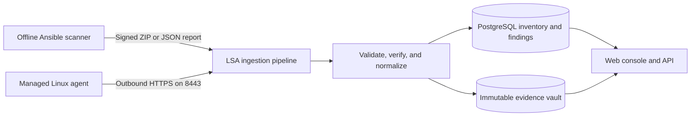

# Linux Security Auditor

## 1. Platform overview

Linux Security Auditor (LSA) is an ingestion-first Linux security and compliance platform. It turns read-only host observations into a persistent, fleet-wide view of security posture, compliance, findings, evidence, and change over time.

LSA supports two collection models:

- **Offline reports** are produced by a customer-controlled Ansible scanner. They can stay inside an isolated environment or be transferred to LSA as signed report bundles.
- **Managed agents** run on Linux hosts, collect the same supported evidence, and communicate with LSA over outbound HTTPS.

Both models feed the same validation, normalization, evidence, and finding pipeline. This gives administrators one console for hosts, groups, policies, control coverage, findings, report history, credentials, and cryptographic provenance regardless of how the data was collected.



LSA does **not** SSH to managed servers, store their privileged credentials, or initiate connections to them. Scans execute inside the customer's environment, and managed agents initiate every platform connection. Remediation is represented in the policy model but is currently locked to audit-only operation on both the server and client.

The current control surface includes:

- A deduplicated 358-control Debian 13 audit: 334 benchmark controls plus 24 non-overlapping portable Linux checks.
- A 62-control portable Linux audit for Debian 12, Ubuntu 22.04/24.04, and RHEL, Rocky Linux, or AlmaLinux 8/9.
- Deployment and benchmark profiles that determine which applicable controls are evaluated.
- New, persistent, and resolved finding comparison across report history.

## 2. Server side and architecture

The server is delivered as a Docker Compose stack. Only the TLS gateway is published; the application and data services remain on the internal Docker network.

| Component | Responsibility | Exposure |
| --- | --- | --- |
| **TLS gateway and web console** | Terminates HTTPS, serves the React console, and proxies API, documentation, and health requests | TCP 8443 only |
| **FastAPI service** | Authentication, fleet management, groups, policies, enrollment, ingestion, validation, findings, and audit events | Internal network |
| **PostgreSQL** | Tenants, users, sessions, hosts, groups, policies, reports, findings, credentials, tasks, and audit metadata | Internal network |
| **MinIO evidence vault** | Retention-enforced storage of original report artifacts with integrity verification | Internal network |
| **Alembic migrations** | Applies versioned database changes before the API starts | Startup job |

### Server data flow

1. The gateway accepts a request over HTTPS on port 8443 and routes it to the console or API.
2. The API authenticates the user, offline-scanner token, or agent identity and applies tenant and resource authorization.
3. Report ingestion validates identity binding, schema, size, safe archive paths, checksums, duplicate submissions, and optional Ed25519 signatures.
4. The original artifact is preserved in the evidence vault while normalized hosts, reports, controls, and findings are stored in PostgreSQL.
5. The console reads those normalized projections to present fleet status, findings, compliance, evidence history, groups, and policies.

### Identity and security foundation

- Local bootstrap authentication plus OIDC presets for Microsoft Entra ID, Okta, Google Workspace, AD FS, and generic providers.
- RADIUS authentication and administrator-created local users for environments that require both external and break-glass access.
- Administrator, analyst, and auditor roles with server-side authorization.
- Database-backed sessions, security audit events, encrypted secrets, and encrypted TLS private keys.
- Host-scoped, expiring, immediately revocable ingestion tokens.
- One-time group enrollment tokens and host-generated Ed25519 identities for managed agents.
- Administrator-managed signing keys with host scope, expiry, revocation, and provenance history.
- Immutable policy versions and restore history; restoring an earlier policy publishes a new version.
- Original-evidence retention, verified download, and deletion audit events.

See [the architecture document](docs/architecture.md) for trust boundaries and design decisions, [the Docker deployment guide](docs/docker-deployment.md) for production operations, and [the evidence-vault guide](docs/evidence-vault.md) for integrity and retention behavior.

## 3. Client side: offline reports and managed agents

The offline scanner and managed agent share normalized contracts and control logic, but they serve different operating environments.

| | Offline report | Managed agent |
| --- | --- | --- |
| **Runtime** | Ansible from a customer-controlled controller | Installed service on each Linux host |
| **Connectivity** | None required for scanning; upload is optional | Outbound HTTPS to LSA on port 8443 |
| **Platform connection** | Signed ZIP transfer or token-authenticated JSON/ZIP upload | Enrolled Ed25519 machine identity |
| **Policy source** | Scanner inventory and variables | Group policy retrieved from LSA |
| **Reporting** | HTML, CSV, JSON, checksum, manifest, and ZIP | Signed heartbeat, policy state, audit task, and report exchange |
| **Best fit** | Isolated, air-gapped, approval-driven, or occasional audits | Continuous fleet visibility and centrally managed audit scope |

### Offline reports

The Ansible scanner collects security observations without changing host configuration. Each enrolled host has a persistent platform UUID and may use a host-scoped ingestion token. For stronger provenance, the controller can sign bundles with an Ed25519 private key while LSA stores only the registered public key.

Delivery modes are:

- `offline` — build and retain the report bundle without contacting LSA.
- `upload` — submit the report to LSA.
- `upload_and_keep` — submit the report and retain the local artifact; this is the production default.

The offline workflow is appropriate when an agent cannot be installed, the target network has no route to the platform, or report transfer requires an explicit approval step.

### Managed agents

The unified Linux agent is available as Debian/Ubuntu (`.deb`), RHEL-family (`.rpm`), and universal (`.tar.gz`) packages downloadable from the console. Package installation stages the agent without starting it. A one-time enrollment command then creates a root-only configuration, generates the host signing key, assigns the agent to exactly one group, and enables its systemd service.

Every group has an effective policy. Policies can select controls by category and set their intended mode, allowing different fleets to have different audit scopes. Publishing a change creates an immutable version. The current safety lock permits audit execution only; write/remediation behavior remains disabled.

Agents poll the platform rather than accepting inbound connections. Their signed heartbeats drive online, stale, and offline status. On-demand audits are persisted, allow-listed tasks consumed on the next poll—not remote shell commands.

See [the agent guide](agent/README.md) for package installation, enrollment, certificate trust, and service operation, and [the report-format guide](docs/report-format.md) for normalized and signed report contracts.

## Quick start

Requirements: Docker Engine with the Compose plugin.

```bash
cp deploy/.env.example deploy/.env
# Replace every placeholder secret in deploy/.env.
make up
```

Open `https://localhost:8443` and sign in with the bootstrap email and password from `deploy/.env`. The first boot uses a self-signed localhost certificate. API documentation is available at `https://localhost:8443/docs`.

The database and evidence objects are stored in named Docker volumes. Migrations run automatically before the API starts, and Compose waits for PostgreSQL, MinIO, the API, and the web gateway to become healthy. Use `make logs`, `make ps`, and `make down` for routine operation.

For direct local development and testing, install Python 3.12+ and Node.js 22+:

```bash
make install
cp .env.example .env
make test
```

The seeded development ingestion token is `lsa_ingest_demo_secret`. It is intentionally local-only and must never be used in production.

## Offline scanner workflow

### Enroll a host

Sign in as an administrator, open **Linux hosts**, and choose **Enroll host**. LSA creates a persistent host UUID and a scoped ingestion token. The raw token is shown once; store it in a mode-0600 file on the Ansible controller and assign the displayed host UUID to `lsa_host_id` in inventory.

The first accepted report binds that platform identity to the host's hashed machine ID. Later reports with a different machine ID are rejected. Administrators can issue, list, and revoke credentials from **Ingestion tokens** or through the `/api/v1/ingestion-tokens` endpoints. Prefer host-scoped tokens with an expiry.

For cryptographic provenance, generate an Ed25519 key with `scanner/scripts/generate_signing_key.py`, register only its public key under **Signing keys**, and add the returned key ID and private-key path to the scanner variables.

### Run the scanner

Copy `scanner/inventory.example.ini`, assign each host its platform UUID, then run:

```bash
cd scanner
ansible-playbook -i inventory.ini playbooks/scan.yml \
  -e lsa_delivery_mode=upload_and_keep
```

Select an LSA deployment profile (`production_server`, `minimal_server`, `router`, or `container`) or a direct benchmark profile (`level1_server`, `level2_server`, `level1_workstation`, or `level2_workstation`) with `lsa_profile`.

### Submit a JSON report directly

```bash
curl --fail-with-body \
  -H "Authorization: Bearer ${LSA_INGEST_TOKEN}" \
  -H "Content-Type: application/json" \
  --data-binary @report.json \
  https://localhost:8443/api/v1/ingest/reports
```

## Managed agent workflow

Open **Agents** in the primary console navigation, choose **Install agent**, and download the package for the target distribution. Assign a policy to a group and create a short-lived, one-time enrollment token. On Debian or Ubuntu, for example:

```bash
sudo apt install ./lsa-agent_0.3.0_all.deb
sudo lsa-agent-enroll --platform-url 'https://lsa.example.com:8443' --token 'lsa_enroll_...'
```

The **Agents** workspace opens on **All hosts**. Select a group in the left fleet rail to view its hosts and effective policy. From there, administrators can publish categorized control overrides, request an audit, move agents to another group, or revoke them.

## Repository map

- `apps/api` — API, data model, ingestion, migrations, and tests
- `apps/web` — React fleet console
- `scanner` — Ansible scanner, report builder, and submission flow
- `agent` — outbound Linux agent runtime, packages, and systemd service
- `packages/contracts` — versioned machine-readable contracts
- `deploy` — Docker Compose deployment
- `docs` — architecture, deployment, evidence, and report-format documentation

GitHub Actions runs backend and frontend tests and executes the complete scanner inside an official Debian 13 container. It validates the normalized report, verifies the portable bundle, and ingests it through the API.
